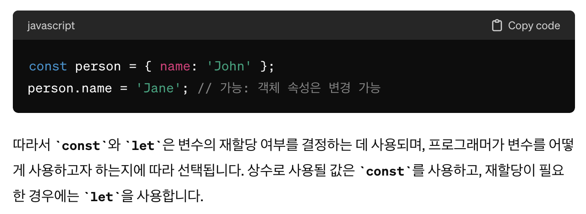

# 11.1 원시 값

> 데이터 값은 크게 원시 타입과 객체 타입으로 구분할 수 있다.

## 11.1.1 변경 불가능한 값

> 원시 타입의 값, 즉 원시 값은 변경 불가능한 값이다.
> 한번 생성된 원시 값은 읽기 전용 값으로서 변경할 수 없다.
> 원시 값 자체를 변경할 수는 없지만 변수 값을 변경 할 수 없다는 것은 아니다.

```jsx
[예제 11-01]
// const 키워드를 사용해 선언한 변수는 재할당이 금지된다. 상수는 재할당이 금지된 변수일 뿐이다.
const o= {};

// const 키워드를 사용해 선언한 변수에 할당한 원시 값(상수)은 변경할 수 없다.
// 하지만 const 키워드를 사용해 선언한 변수에 할당한 객체는 변경할 수 있다.
o.a = 1;
console.log(o); // {a : 1}
```

> deep dive 외 추가 설명 : const 와 let의 차이, const는 진짜 재할당 불가일까?




> 원시 값을 재할당 하면 이전의 원시 값을 변경하는 것이 아니라 `새로운 메모리 공간`을 확보하고 재할당한 원시 값을 저장한 후, 변수는 새롭게 재할당한 원시 값을 가리킨다. 이때 변수가 참조하던 `메모리 공간의 주소`가 바뀐다.
> `불변성을 갖는 원시 값을 할당한 변수는 재할당 이외에 변수 값을 변경 할 수 있는 방법이 없다.` 그 이유는 상태 변경을 추적할 수 있게 하려고 이다.
> 

## 11.1.2 문자열과 불변성

> deep dive + 별도 설명 (이해 안되서 별도 설명 찾아봄)
> 언어에서는 문자열을 처리하는 방식이 다르며, 특히 자바스크립트에서는 문자열에 대한 특별한 원시 타입이 제공되어 편리하게 문자열을 다룰 수 있습니다.<br/>

### C 언어

> C 언어에서는 문자열을 문자의 배열로 처리합니다.

```jsx
char myString[] = "Hello, World!";
```

### 자바 언어

> 자바에서는 문자열을 String 클래스의 객체로 처리합니다.

```jsx
String myString = "Hello, World!";
```

### 자바스크립트 언어

> 자바스크립트에서는 문자열을 위한 특별한 원시 타입이 제공됩니다. 즉, 문자열은 객체가 아닌 원시 값으로 취급되며, String 객체를 생성하지 않아도 리터럴로 문자열을 표현할 수 있습니다.

```jsx
let myString = "Hello, World!";
```

### 유사 배열 객체

> 유사 배열 객체란 마치 배열처럼 인덱스로 프로퍼티 값에 접근할 수 있고 length 프로퍼티를 갖는 객체를 말한다. 문자열은 마치 배열처럼 인덱스를 통해 각 문자에 접근할 수 있으며, length 프로퍼티를 갖기 때문에 유사 배열 객체이고 for 문으로 순회할 수 있다.(++ c언어와 자바 언어 특성을 혼합한듯...지멋대로군...;;)

```jsx
var str = "string";

// 문자열은 유사 배열이므로 배열과 유사하게 인덱스를 사용해 각 문자에 접근 할 수 있다.
console.log(str[0]); //s

// 원시 값인 문자열이 객체처럼 동작한다.
console.log(str.length); // 6
console.log(str.toUpperCase()); // STRING
```

```jsx
var str = "string";

//문자열은 유사 배열이므로 인덱스를 사용해 문자에 접근가능하지만 문자열은 원시 값이므로 변경할 수 없다.
str[0] = "S";
console.log(str); //string

// ++ deep dive외 그럼 어떻게 변경?
// 하단처럼 하면 총 2개의 메모리에 할당 되는거다 (처음 string값, another값)
var str = "string";
str = "another"; // 변수 str에 새로운 문자열 'another'를 할당

console.log(str); // "another"
```

## 11.1.3 값에 의한 전달

> ++ deep dive외 궁금점 : 아래 코드에는 몇개의 메모리가 할당 되었을까? 총 3개
>
> 1. var score = 80;: 숫자형 원시 값 80에 대한 메모리가 할당됩니다.
> 2. var copy = score;: score 변수의 값을 copy 변수에 복사합니다. score와 copy는 이후 같은 값을 가리키는 것처럼 보이지만, 실제로는 각각의 변수가 독립적인 메모리를 가지고 있습니다.
> 3. score = 100;: score 변수에 새로운 숫자형 원시 값 100이 할당됩니다.

```jsx
[예제 11-06]
var score = 80;
var copy = score;

console.log(score); // 80
console.log(copy); // 80

score = 100;

concole.log(score); //100
console.log(copy); // ?
```


> 참고 : 파이썬의 경우 변수의 원시 값을 갖는 변수를 할당하는 시점에는 두 변수가 같은 원시 값을 참조하다가 어느 한쪽의 변수에 재할당이 이뤄졌을 때 비로소 새로운 메모리 공간에 재할당된 값을 저장한다.
> 메모리 낭비가 없어서 더 효율적인듯....(my think!)
> 

# 11.2 객체

> 객체는 프로퍼티의 개수가 정해져 있지 않으며, 동적으로 추가되고 삭헤할 수 있다.
> (my think!) {} 요런 모양의 바구니에 막 담는 모양이니까 그런듯..

## 11.2.1 변경 가능한 값

> 객체(참조) 타입의 값, 즉 객체는 변경 가능한 값 이다.
> (++)원시값 즉 person은 변경 불가한 값이지만 그 안에 객체는 변경 가능한 값이다.

```jsx
[예제 11-11]
var person = {
  name: 'Lee'
};

// 프로퍼티 값 갱신
person.name = 'Kim';

// 프로퍼티 동적 생성
person.address = 'Seoul';

console.log(person); // {name: "kim" , address: "seoul"}
```

> (my think!) 덮어 쓰는 방식으로 사용하는것을 말하는듯, 변수처럼 매번 메모리를 다르게 만들면 비용이 많이 들고 메모리의 효율적 소비가 어렵고 성능이 나빠진다. 따라서 메모리를 효율적으로 사용하기 위해, 그리고 객체를 복사해 생성하는 비용을 절약하여 성능을 향상시키기 위해 객체는 변경 가능한 값으로 설계 되어 있다.
> (단점 : 여러개의 식별자가 하나의 객체를 공유할 수 있다)


### 얕은 복사와 깊은 복사...

> 객체를 프로퍼티 값으로 갖는 객체의 경우 얕은 복사는 한 단계까지만 복사하는 것을 말하고 깊은 복사는 객체에 중첩되어 있는 개체까지 모두 복사하는 것을 말한다.
> (my think!) 깊은 복사를 통해서 위에서 설명한 여러개의 식별자가 하나의 객체를 공유한다는 단점을 해소 할 수 있을 듯...
> 얕은 복사(총 2개의 메모리 사용) : 최상위 레벨만을 복사하고, `내부의 참조값은 동일한 메모리 주소`를 공유합니다.
> 
> 깊은 복사(총 3개의 메모리 사용) : 내부의 모든 참조값을 재귀적으로 새로운 메모리 공간에 복사하여 두 객체가 `서로 독립적인 메모리`s를 참조합니다
> 

## 11.2.2 참조에 의한 전달

> 여러 개의 식별자가 하나의 객체를 공유할 수 있다는 것에 대한 의미와 부작용 설명

```jsx
[예제 11-16]
var person = {
  name: 'Lee'
};

// *****참조 값을 복사(얕은 복사)
var copy = person;
// 문제점 !!!! 두 개의 식별자(person, copy)가 하나의 객체를 공유하게 된다.
// 원본 또는 사본 중 어느 한쪽에서 객체를 변경(프로퍼티 변경 추가 삭제등)하면 서로 영향을 주고 받음
console.log(copy === person); //true

// copy를 통해 객체를 변경한다.
copy.name = 'Kim';

// person을 통해 객체를 변경한다.
person.address = 'Seoul';

// copy와 person은 동일한 객체를 가리키기 때문에 어느 한쪽에서 변경하면 서로 영향을 끼친다.
console.log(person); // {name: "kim", address: "Seoul"}
console.log(copy; // {name: "kim", address: "Seoul"}
```
